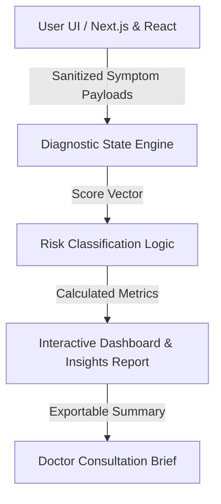

# 🌸 OvaCare — AI-Powered Women's Health & PCOS Risk Assessment Platform

[](https://www.typescriptlang.org/)
[](https://nextjs.org/)
[](https://fastapi.tiangolo.com/)
[](https://tailwindcss.com/)
[](https://opensource.org/licenses/MIT)

**OvaCare** is a modern, privacy-focused diagnostic web application designed to help women identify early risk markers of Polycystic Ovary Syndrome (PCOS/PCOD). By combining structured clinical questionnaires, lifestyle pattern analysis, and risk scoring algorithms, OvaCare provides users with actionable insights and personalized guidance.

---

## ✨ Key Features

- 🩺 **Multi-Factor Risk Scoring**: Evaluates metabolic, hormonal, and lifestyle risk factors based on established clinical guidelines.
- ⚡ **Interactive Symptom Flow**: Responsive, empathetic questionnaire UI designed with TypeScript and reactive state management.
- 📊 **Dynamic Risk Dashboard**: Visual breakdown of risk tiers (Low / Moderate / Elevated) with categorical score distributions.
- 🔒 **Privacy-First Architecture**: Client-side data sanitization ensures sensitive personal health data remains secure and private.
- 💡 **Personalized Wellness Recommendations**: Generates tailored nutrition, sleep, and lifestyle recommendations to discuss with healthcare providers.

---

## 🏗 System Architecture



---

## 🛠 Tech Stack

- **Frontend**: TypeScript, React.js / Next.js, Tailwind CSS, Lucide Icons
- **Backend / Logic**: Python / FastAPI (or Next.js API Routes), Pydantic for schema validation
- **State & Storage**: React Context / Zustand, LocalStorage for persistent local sessions

---

## 🚀 Quick Start Guide

### Prerequisites
- Node.js (v18.0 or higher)
- npm or yarn

### Installation
```bash
# 1. Clone the repository
git clone https://github.com/smsolutionsva-byte/OvaCare.git

# 2. Navigate to directory
cd OvaCare

# 3. Install dependencies
npm install

# 4. Start development server
npm run dev
```
Open [http://localhost:3000](http://localhost:3000) in your browser to test the app.

---

## 🎯 Resume Bullet Points
- **Engineered an AI-driven women's health risk assessment platform (OvaCare)** analyzing multi-dimensional symptom vectors for early PCOS/PCOD risk identification.
- **Architected reactive TypeScript & Next.js frontend**, delivering sub-100ms UI transitions and privacy-conscious questionnaire state management.
- **Formulated structured clinical scoring metrics**, providing users with categorical risk breakdowns and actionable doctor-consultation briefs.

---

## 👤 Author
- **Shivansh Mukhia** — [GitHub](https://github.com/smsolutionsva-byte) • [Email](mailto:sm.solutions.va@gmail.com)
